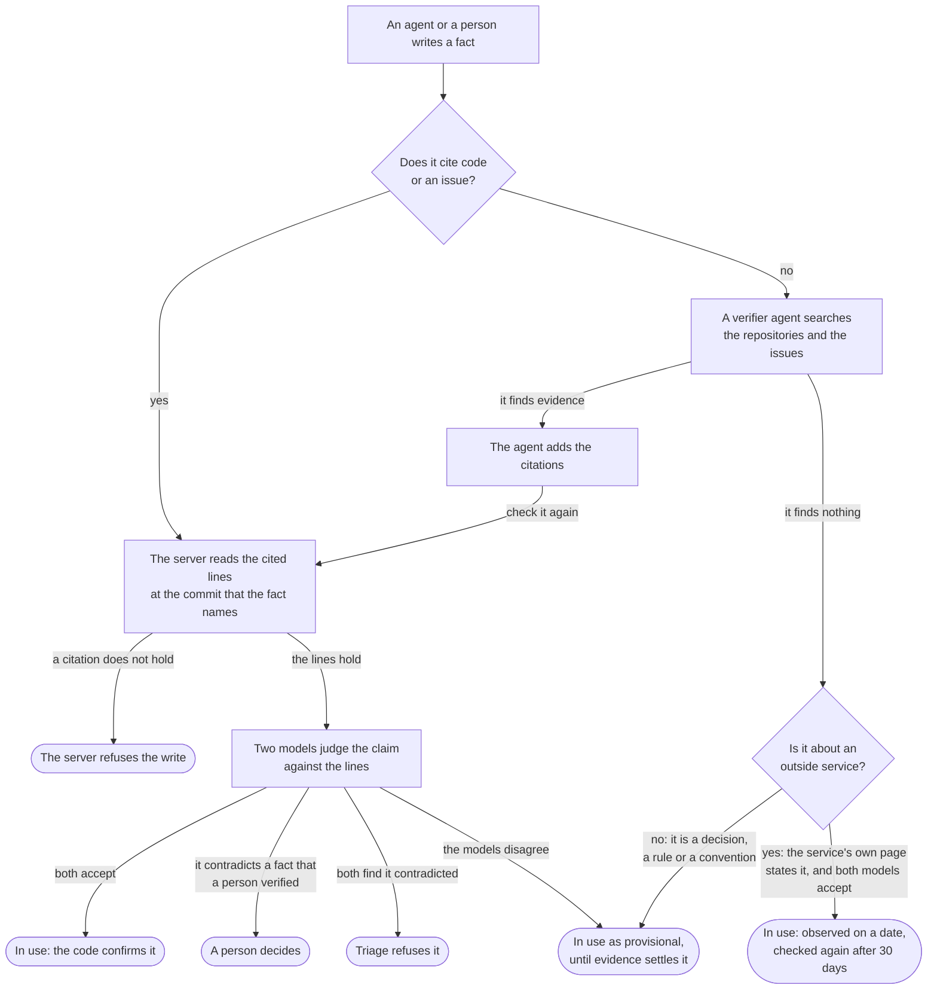

## Overview

The knowledge bank holds what your workspace knows about its own software: the
decisions, the conventions and the traps that the code does not say. It has
two readers:

- **People read pages.** A page is documentation, written as prose.
- **Agents read and write entries.** An entry is one fact, added under a page.
  Each entry says who wrote it, where it applies, what it rests on, and
  whether a person has confirmed it.

Agents reach the bank through the MCP server, and hosted agent runs are given
the relevant part of it when they start. The server checks each fact against
the code that it cites. A person decides what agents may use. The bank also
measures whether the knowledge helps: a share of runs gets no knowledge, and
the server compares them with the others. Read
[The holdout](/fundamentals/knowledge/gardener#the-holdout).

This page is the overview. Two more pages give the details:

- [Needs you](/fundamentals/knowledge/needs-you) is the list of the decisions
  that wait for a person: the kinds of item, the answers, assignment and
  comments.
- [The Gardener](/fundamentals/knowledge/gardener) is the set of background
  jobs that keep the bank current, and the screens that show what they did.
  It also holds the settings of the bank.

## Pages

A page is prose for people. You can link a page to a team, a project, an
issue, another page, a product, a module or a capability. An agent that works
on that item then finds the page directly.

Each page has an entry policy, which controls what agents can add to it:

| Policy | What agents can do |
|---|---|
| `OPEN` | Add entries freely. For scratch work. |
| `CURATED` | Add entries, with the checks for repeats and the per-token budget. The default. |
| `LOCKED` | Read the page, but add nothing. People maintain it by hand. |

A page is **authored** (people write it, the default) or **generated** (the
server writes it from entries). See
[Generated pages](/fundamentals/knowledge/gardener#generated-pages).

On a page, the **Facts behind this page** rail shows the entries of the page.
Each fact shows its kind, its trust, its author, and how many runs got it. A
fact in the page body says "in the page body". A fact that waits for a
person has a **Decide** link to Needs you. A fact in use has a menu, which
shows when you move the pointer over the fact. Use it to confirm the fact, to
stop its use, to mark it as wrong, or to move it to a different page. Click **Add a fact** to add a fact in use.

## Entries

An entry is one fact. An entry that holds six claims cannot be scoped,
confirmed or corrected one claim at a time, so the server refuses an entry
that reads as a list or a summary. It also refuses an entry that looks like
it contains a credential.

Each entry has a kind:

| Kind | Meaning |
|---|---|
| `FACT` | Something true about the system. The default. |
| `DECISION` | A choice that was made, and the reason for it. |
| `CONVENTION` | How things are done here: a rule that a newcomer would not guess. Once accepted, every hosted agent run in its modules gets it. |
| `GOTCHA` | Something that cost somebody time. |

An entry can have a **scope**: a folder, for example `apps/server`. The server
resolves the scope to the modules of your repositories. An entry scoped to
`apps/server` is served for work in `apps/server/prisma`, and the reverse. An
entry without a scope is served for every query.

Each entry has a status:

| Status | Meaning | Served to agents |
|---|---|---|
| `PROPOSED` | Waiting for triage or a person. Every new entry from an agent starts here. | No |
| `STANDING` | Accepted. | Yes |
| `CONSOLIDATED` | Accepted, and written into its page's body. Served as evidence for that page, and corrected like a standing entry. | Yes |
| `SUPERSEDED` | Replaced by a newer entry. Kept for the record. | No |
| `DISPUTED` | Contradicts the code or another entry. Held back until a person resolves it. | No |
| `ARCHIVED` | Out of use: rejected, or not used for a long time. | No |

`PROVISIONAL` is not a status. A provisional entry is a `STANDING` or
`CONSOLIDATED` entry that triage put in use without proof. The server marks
it with the date that it became provisional, and serves it with the trust tier
`PROVISIONAL`. See [Provisional facts](#provisional-facts).

An agent that finds an entry is wrong writes a new entry that **supersedes**
it. The old entry stays in use until a person accepts the correction.

Before the server writes an entry, it searches for entries that say nearly the
same thing. If it finds any, it writes nothing and returns them. The agent
then supersedes one of them, or says that its fact is distinct.

## Citations and trust

An entry can cite what it rests on, up to ten citations:

- **Code:** a file path, a line range, and the commit that the agent read.
  A short quote from the lines is optional, and catches a wrong line number.
- **Where something was decided:** an issue, a pull request, a comment or an
  agent run.
- **An outside page:** a public https page and a quote from it, for a fact
  about an outside service, for example a vendor API or a cloud setting. The
  quote must be 20 to 1000 characters.

### The check when an entry is written

The server reads each cited file itself before it writes the entry. If a
citation does not hold (there is no file at that path and commit, the lines
run past the end of the file, or the quote is not in the lines), the server
refuses the write and names the citation. If the repository cannot be reached
at that moment, the server writes the entry and reads the citation later.

The server reads a cited outside page itself, and finds the quote on it. It
reads only public https pages. It refuses an address that is private,
loopback, link-local or reserved, and it checks the target of each redirect
in the same way. The server keeps the quote as the page gives it, with the
date of the read.

### Trust tiers

Each entry is served with a trust tier, and with the result and the age of
each citation's last check:

| Tier | Meaning |
|---|---|
| `HUMAN_VERIFIED` | A person confirmed the entry. |
| `GROUNDED` | The entry is accepted, and every citation was read and still holds. |
| `OBSERVED` | The entry is accepted, it cites an outside page, and every citation still holds. The citation shows the date that the server last read the page. |
| `UNGROUNDED` | Nothing that was checked supports the entry, or the code that it cites has changed or gone. An agent checks it against the code before relying on it. |
| `PROVISIONAL` | The entry is in use, but nothing confirmed it yet. Triage found no reason to refuse it and no reason to ask a person. An agent checks it before relying on it. A person's confirmation wins over this tier. See [Provisional facts](#provisional-facts). |

Verified entries rank first. Grounded and observed entries rank next, and a
grounded entry wins over an observed one when the two contradict. Provisional
entries rank last. Apart from the conventions of its modules, a hosted agent
run is given verified, grounded or observed entries, and a maximum of two
provisional ones.

### Checks when the code changes

When a pull request merges into the default branch, or a push lands on it,
the server reads every entry that cites a file the change touched:

- The cited lines are the same, or moved elsewhere in the file: the entry
  stays as it is.
- The cited lines changed: a model judges whether the new code still
  supports the claim. If the code now contradicts the claim, the entry becomes
  `DISPUTED`, and an issue labelled `knowledge` goes to the team that owns the
  module. A person corrects the entry and puts it back, or archives it.
- The cited file is gone, or no model could judge the change: a person is
  asked to decide. Nothing changes on its own.

### Checks of outside pages

The nightly pass reads each cited outside page again 30 days after the last
read. If the quote is still on the page, the entry stays observed, with the
new date. If the quote or the page is gone, the entry becomes ungrounded, and
agent runs stop getting it. If the server cannot read the page for 60 days,
the entry becomes ungrounded too.

### Decay

Knowledge that nobody uses is not load-bearing, so a nightly pass archives it:

- A proposed entry that waited longer than `PAGE_PROPOSED_ENTRY_EXPIRY_DAYS`.
- A standing entry that was not served in `PAGE_STANDING_ENTRY_DECAY_DAYS`.
- A provisional entry that was not served in `PAGE_PROVISIONAL_ENTRY_DECAY_DAYS`.
- A provisional entry for which runs had more harmful outcomes than helpful
  ones.

The pass keeps an entry if one of its citations was checked and held within
that window. It never archives an entry that a person verified; it asks a
person instead. It never archives an entry that a page cites, because the
page is read in its place. Outcomes of agent runs archive only provisional
entries, and never delete knowledge.

## What agents get

- **`load_context`** returns what the bank knows about an area, within a token
  budget. An agent calls it before it starts work.
- **`recall_knowledge`** answers a question from the bank.
- **A hosted agent run** gets the conventions of its issue's modules first,
  then the `KNOWLEDGE_CONTEXT_TOP_K` most relevant verified, grounded or
  observed entries, within `KNOWLEDGE_CONTEXT_TOKEN_BUDGET` tokens. A maximum
  of two provisional entries follow them, labelled as provisional. Each entry
  shows its citation and its age.

The server reads a maximum of 25 conventions for one run: the conventions
that a person confirmed first, then the newest. A provisional convention is
not among them. The token budget can cut a convention, as it can cut any
entry. An issue with no modules gets no conventions.

`load_context` and `recall_knowledge` also serve a maximum of two provisional
entries, after the others. A provisional convention is served only when it is
relevant. It is not given to every run in its modules until it is promoted.

The server records each time an entry is served. When a run ends, its checks,
its review and its pull request (merged or closed) count as helpful or harmful
for the entries that the run was given, where the evidence falls under them.
A harmful outcome makes the server check the entry's citations again.

## How a fact gets settled

Agents settle what evidence can settle. A person sees a fact only when it
needs a judgment that no code and no issue can give.

Two safety nets also send a fact to a person. The first is a fact that rests
on text from outside the workspace (`EXTERNAL_INPUT`), because such text can
carry instructions to an agent. The second is the audit, which samples what
triage did alone.

### The verifier

When triage escalates a fact because it cites no evidence, a verifier agent
looks for evidence first. The fact stays out of Needs you while the
verifier looks, for a maximum of one hour. The verifier can search and read
the code of the fact's modules, the workspace's issues, and public pages. It
cannot change anything. It proposes a maximum of three citations, and the
server checks each one as it checks a citation that a writer gives. The server
attaches only the citations that hold, and triage decides again.

The verifier uses the model and the key that the workspace set in its agent
settings. It never uses a key of the deployment. If the workspace has no
model or key for agents, the verifier does not look, and the fact goes to a
person.

### Triage decides again

Triage decides again when the evidence of a waiting fact changes: a citation
that the server could not read now holds, a change lands in a cited file, a
served fact now says the same thing, or the verifier adds citations. Each
decision records what caused it.

After a fact is in use, the server checks it again each time the code that it
cites changes. See [Checks when the code changes](#checks-when-the-code-changes).

People also check the decisions that triage makes alone. A share of them goes
to a person as an [audit](/fundamentals/knowledge/needs-you#audits). When
people and triage agree less than the floor for one type of decision, that
type stops acting and asks a person. See
[Agreement](/fundamentals/knowledge/gardener#agreement).

## Triage and escalation

The server triages each new entry before a person sees it:

1. **Policy.** An entry that contains a credential, or holds more than one
   claim, is refused. An entry that rests on text from outside the workspace
   goes to a person.
2. **Exact repeats.** An entry that says exactly what an existing entry says
   is folded into that entry, which counts it as a corroboration.
3. **Neighbours.** For each existing entry that is similar enough
   (`KNOWLEDGE_SIMILARITY_THRESHOLD`), rules in code and two model judgments
   decide how the two relate: a duplicate, a refinement, a replacement, a
   contradiction, or a different fact.
4. **Grounding.** Every citation must hold. A fact with no evidence goes to
   the verifier before a person sees it.
5. **Decision.** Triage accepts the entry, puts it in use as provisional,
   folds it into another, refuses it, or escalates it to a person.

`KNOWLEDGE_AUTO_TRIAGE` controls whether triage acts:

| Mode | What happens |
|---|---|
| `off` | No triage. Every entry waits for a person. |
| `shadow` | Triage decides and records each decision, but changes nothing. The default. Compare its decisions with what people decide before you turn it on. |
| `on` | Triage accepts, puts in use as provisional, folds in and refuses as it decides. Escalations still wait for a person. |

Triage accepts an entry without a person only when every condition holds: the
entry says one thing, it cites code, an issue, a comment or an outside page,
every citation holds, it contradicts nothing that a person verified or that a locked page
holds, and two separate model judgments accept it. The writer does not change
this: triage accepts a grounded entry from an agent as it accepts one from a
person. For a convention or a decision, the judges accept only evidence that
states the rule or the decision, not code that only follows a practice.

### Provisional facts

Most facts that are not proven are not wrong. A decision, a rule, or a fact
about an outside service often has no line of code that states it. Triage
does not send each such fact to a person. It puts the fact in use as
provisional, and evidence settles it later.

Triage makes an entry provisional when the only reasons against it are these:
`UNGROUNDED`, `CITATION_FAILED`, `UNKNOWN_SOURCE`, `JUDGES_DISAGREE`,
`PIN_REQUEST` and `BROAD_SCOPE`. Any other reason sends the entry to a person.

Triage refuses an entry when both judges find that its evidence contradicts
it, and that evidence includes code or an outside page. An issue or a comment
tells of a change, often starting from the problem before it, so it never
refuses a claim alone: a person decides. The judges see each cited issue's
state. It also refuses an entry when it contradicts an entry in use that ranks
above it, for example a grounded entry. When only one judge finds the
evidence contradicts it, a person decides (`EVIDENCE_DISPUTED`).

A provisional entry is promoted to a full entry when one of these occurs:

- Triage decides again and accepts it, for example because the verifier
  found evidence.
- Two other writes say the same thing.
- Runs that were given it had two or more helpful outcomes and no harmful one.
- A person keeps it, verifies it, or edits it.

A provisional entry is taken out of use when one of these occurs:

- A grounded entry says the same thing, or contradicts it. The provisional
  entry is archived.
- A newer provisional entry contradicts it. The older one is archived.
- Evidence that it gains is contested. It goes to a person.
- Decay archives it. See [Decay](#decay).

Triage never audits a provisional decision, because a provisional entry is
not trusted yet. Triage records the version of the rules that it decided by.
When the rules change, a waiting entry that was decided by older rules is
decided again.

An escalated entry waits in [Needs you](/fundamentals/knowledge/needs-you),
with the reasons attached. The reasons in the list above send an entry to a
person only together with another reason. See
[Why a fact waits](/fundamentals/knowledge/needs-you#why-a-fact-waits) for
every reason.

Only people can accept, dispute or verify an entry, answer an audit, or accept
or decline a proposal. The server refuses these actions from an agent. An
agent can only change or archive its own entries while they are still
proposed.

The [Gardener](/fundamentals/knowledge/gardener) holds the settings of
triage, of the audits and of the context of a run.

## Consolidation

When a page has many entries that now read as a paragraph, consolidate them:
fold them into the page's body.

- **A proposal, never a direct change.** Consolidating an authored page, by an
  agent or a person, stores a proposal: the new body, and the entries that it
  folds in. The page does not change. A person accepts or declines the
  proposal in [Needs you](/fundamentals/knowledge/needs-you), as a
  **Page rewrite** item. When you consolidate from the page in the
  webapp, you propose and accept in one step.
- **Accepting checks the page again.** The server refuses to accept a proposal
  if the page changed after the proposal was made, if the page is now
  generated, or if an entry that it folds in is no longer standing.
- **The entries stay as evidence.** Accepted, the entries become
  `CONSOLIDATED`. They are still served, marked as evidence for the page and
  ranked below it. They keep their trust tier, and decay does not archive them.
  Entries consolidated by an earlier version of Vantik, which the search index
  used to drop, are indexed again the next time the server starts.
- **They are still checked and corrected.** A consolidated entry is checked
  again when the code changes, and triage compares new entries with it, as for
  a standing entry. A correction can supersede it, and a person can dispute or
  archive it from the fact's menu in the **Facts behind this page** rail. The
  rail marks the fact "in the page body". The page's body keeps
  the old text until a person rewrites it. A consolidated convention is still
  handed to every run on its modules. If runs report it as harmful, a person is
  asked whether to archive it, since the page's body says it too.
- **Undo it with a revert.** Reverting the accepted change restores the old
  body, and puts the entries back in use as standing entries. Undoing that
  revert brings the consolidated body back, and folds back in the entries that
  are still standing, so a fact is never served both in the body and beside it.
