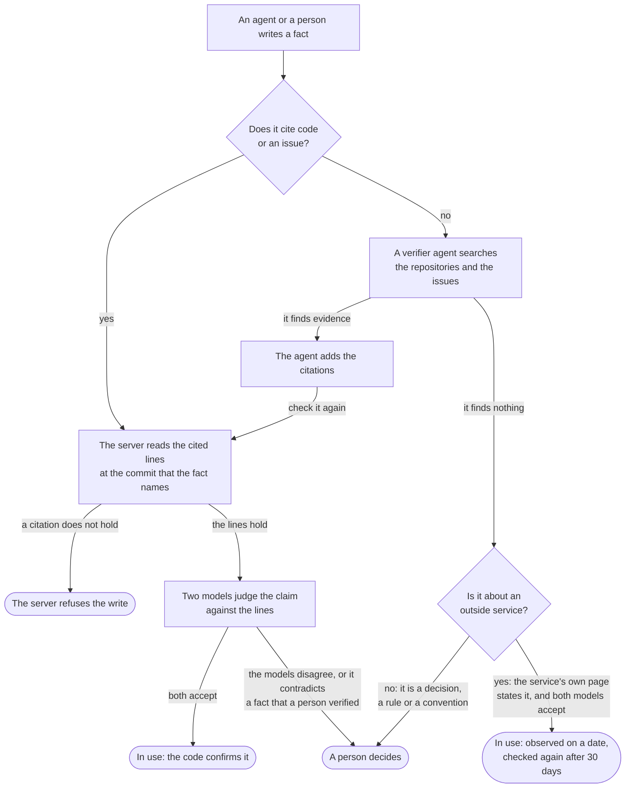
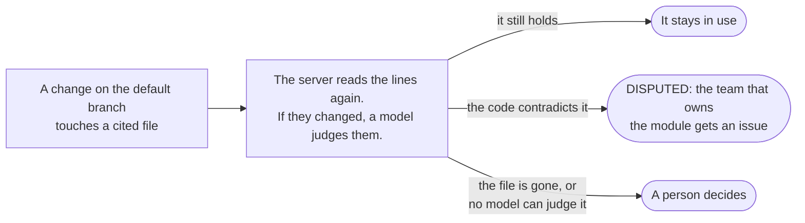

## Overview

The knowledge bank holds what your workspace knows about its own software: the
decisions, the conventions and the traps that the code does not say. It has
two readers:

- **People read pages.** A page is documentation, written as prose.
- **Agents read and write entries.** An entry is one fact, added under a page.
  Each entry says who wrote it, where it applies, what it rests on, and
  whether a person has confirmed it.

Agents reach the bank through the MCP server, and hosted agent runs are given
the relevant part of it when they start. The server checks each fact against
the code that it cites. A person decides what agents may use. The bank also
measures whether the knowledge helps.

## Pages

A page is prose for people. You can link a page to a team, a project, an
issue, another page, a product, a module or a capability. An agent that works
on that item then finds the page directly.

Each page has an entry policy, which controls what agents can add to it:

| Policy | What agents can do |
|---|---|
| `OPEN` | Add entries freely. For scratch work. |
| `CURATED` | Add entries, with the checks for repeats and the per-token budget. The default. |
| `LOCKED` | Read the page, but add nothing. People maintain it by hand. |

A page is **authored** (people write it, the default) or **generated** (the
server writes it from entries). See [Generated pages](#generated-pages).

## Entries

An entry is one fact. An entry that holds six claims cannot be scoped,
confirmed or corrected one claim at a time, so the server refuses an entry
that reads as a list or a summary. It also refuses an entry that looks like
it contains a credential.

Each entry has a kind:

| Kind | Meaning |
|---|---|
| `FACT` | Something true about the system. The default. |
| `DECISION` | A choice that was made, and the reason for it. |
| `CONVENTION` | How things are done here: a rule that a newcomer would not guess. Once accepted, every hosted agent run in its modules gets it. |
| `GOTCHA` | Something that cost somebody time. |

An entry can have a **scope**: a folder, for example `apps/server`. The server
resolves the scope to the modules of your repositories. An entry scoped to
`apps/server` is served for work in `apps/server/prisma`, and the reverse. An
entry without a scope is served for every query.

Each entry has a status:

| Status | Meaning | Served to agents |
|---|---|---|
| `PROPOSED` | Waiting for triage or a person. Every new entry from an agent starts here. | No |
| `STANDING` | Accepted. | Yes |
| `CONSOLIDATED` | Accepted, and written into its page's body. Served as evidence for that page, and corrected like a standing entry. | Yes |
| `SUPERSEDED` | Replaced by a newer entry. Kept for the record. | No |
| `DISPUTED` | Contradicts the code or another entry. Held back until a person resolves it. | No |
| `ARCHIVED` | Out of use: rejected, or not used for a long time. | No |

An agent that finds an entry is wrong writes a new entry that **supersedes**
it. The old entry stays in use until a person accepts the correction.

Before the server writes an entry, it searches for entries that say nearly the
same thing. If it finds any, it writes nothing and returns them. The agent
then supersedes one of them, or says that its fact is distinct.

## Citations and trust

An entry can cite what it rests on, up to ten citations:

- **Code:** a file path, a line range, and the commit that the agent read.
  A short quote from the lines is optional, and catches a wrong line number.
- **Where something was decided:** an issue, a pull request, a comment or an
  agent run.
- **An outside page:** a public https page and a quote from it, for a fact
  about an outside service, for example a vendor API or a cloud setting. The
  quote must be 20 to 1000 characters.

### The check when an entry is written

The server reads each cited file itself before it writes the entry. If a
citation does not hold (there is no file at that path and commit, the lines
run past the end of the file, or the quote is not in the lines), the server
refuses the write and names the citation. If the repository cannot be reached
at that moment, the server writes the entry and reads the citation later.

The server reads a cited outside page itself, and finds the quote on it. It
reads only public https pages. It refuses an address that is private,
loopback, link-local or reserved, and it checks the target of each redirect
in the same way. The server keeps the quote as the page gives it, with the
date of the read.

### Trust tiers

Each entry is served with a trust tier, and with the result and the age of
each citation's last check:

| Tier | Meaning |
|---|---|
| `HUMAN_VERIFIED` | A person confirmed the entry. |
| `GROUNDED` | The entry is accepted, and every citation was read and still holds. |
| `OBSERVED` | The entry is accepted, it cites an outside page, and every citation still holds. The citation shows the date that the server last read the page. |
| `UNGROUNDED` | Nothing that was checked supports the entry, or the code that it cites has changed or gone. An agent checks it against the code before relying on it. |

Verified entries rank first. Grounded and observed entries rank next, and a
grounded entry wins over an observed one when the two contradict. Apart from
the conventions of its modules, a hosted agent run is given only verified,
grounded or observed entries.

### Checks when the code changes

When a pull request merges into the default branch, or a push lands on it,
the server reads every entry that cites a file the change touched:

- The cited lines are the same, or moved elsewhere in the file: the entry
  stays as it is.
- The cited lines changed: a model judges whether the new code still
  supports the claim. If the code now contradicts the claim, the entry becomes
  `DISPUTED`, and an issue labelled `knowledge` goes to the team that owns the
  module. A person corrects the entry and puts it back, or archives it.
- The cited file is gone, or no model could judge the change: a person is
  asked to decide. Nothing changes on its own.

### Checks of outside pages

The nightly pass reads each cited outside page again 30 days after the last
read. If the quote is still on the page, the entry stays observed, with the
new date. If the quote or the page is gone, the entry becomes ungrounded, and
agent runs stop getting it. If the server cannot read the page for 60 days,
the entry becomes ungrounded too.

### Decay

Knowledge that nobody uses is not load-bearing, so a nightly pass archives it:

- A proposed entry that waited longer than `PAGE_PROPOSED_ENTRY_EXPIRY_DAYS`.
- A standing entry that was not served in `PAGE_STANDING_ENTRY_DECAY_DAYS`.

The pass keeps an entry if one of its citations was checked and held within
that window. It never archives an entry that a person verified; it asks a
person instead. It never archives an entry that a page cites, because the
page is read in its place. Outcomes of agent runs never delete knowledge.

## What agents get

- **`load_context`** returns what the bank knows about an area, within a token
  budget. An agent calls it before it starts work.
- **`recall_knowledge`** answers a question from the bank.
- **A hosted agent run** gets the conventions of its issue's modules first,
  then the `KNOWLEDGE_CONTEXT_TOP_K` most relevant verified, grounded or
  observed entries, within `KNOWLEDGE_CONTEXT_TOKEN_BUDGET` tokens. Each entry shows its
  citation and its age.

The server records each time an entry is served. When a run ends, its checks,
its review and its pull request (merged or closed) count as helpful or harmful
for the entries that the run was given, where the evidence falls under them.
A harmful outcome makes the server check the entry's citations again.

## How a fact gets settled

Agents settle what evidence can settle. A person sees a fact only when it
needs a judgment that no code and no issue can give.

### The verifier

When triage escalates a fact because it cites no evidence, a verifier agent
looks for evidence first. The fact stays out of the review queue while the
verifier looks, for a maximum of one hour. The verifier can search and read
the code of the fact's modules, the workspace's issues, and public pages. It
cannot change anything. It proposes a maximum of three citations, and the
server checks each one as it checks a citation that a writer gives. The server
attaches only the citations that hold, and triage decides again.

The verifier uses the model and the key that the workspace set in its agent
settings. It never uses a key of the deployment. If the workspace has no
model or key for agents, the verifier does not look, and the fact goes to a
person.

### Triage decides again

Triage decides again when the evidence of a waiting fact changes: a citation
that the server could not read now holds, a change lands in a cited file, a
served fact now says the same thing, or the verifier adds citations. Each
decision records what caused it.

After a fact is in use, the server checks it again each time the code that it
cites changes. See [Checks when the code changes](#checks-when-the-code-changes).

People also check the decisions that triage makes alone. A share of them goes
to a person as an audit. When people and triage agree less than the floor for
one type of decision, that type stops acting and asks a person. See
[Audits and agreement](#audits-and-agreement).

## Triage and escalation

The server triages each new entry before a person sees it:

1. **Policy.** An entry that contains a credential, or holds more than one
   claim, is refused. An entry that rests on text from outside the workspace
   goes to a person.
2. **Exact repeats.** An entry that says exactly what an existing entry says
   is folded into that entry, which counts it as a corroboration.
3. **Neighbours.** For each existing entry that is similar enough
   (`KNOWLEDGE_SIMILARITY_THRESHOLD`), rules in code and two model judgments
   decide how the two relate: a duplicate, a refinement, a replacement, a
   contradiction, or a different fact.
4. **Grounding.** Every citation must hold. A fact with no evidence goes to
   the verifier before a person sees it.
5. **Decision.** Triage accepts the entry, folds it into another, refuses it,
   or escalates it to a person.

`KNOWLEDGE_AUTO_TRIAGE` controls whether triage acts:

| Mode | What happens |
|---|---|
| `off` | No triage. Every entry waits for a person. |
| `shadow` | Triage decides and records each decision, but changes nothing. The default. Compare its decisions with what people decide before you turn it on. |
| `on` | Triage accepts, folds in and refuses as it decides. Escalations still wait for a person. |

Triage accepts an entry without a person only when every condition holds: the
entry says one thing, it cites code, an issue, a comment or an outside page,
every citation holds, it contradicts nothing that a person verified or that a locked page
holds, and two separate model judgments accept it. The writer does not change
this: triage accepts a grounded entry from an agent as it accepts one from a
person. For a convention or a decision, the judges accept only evidence that
states the rule or the decision, not code that only follows a practice.

### Escalation reasons

An escalated entry waits in the review queue, with the reasons attached:

| Reason | Meaning |
|---|---|
| `CONTRADICTS_VERIFIED` | It contradicts an entry that a person verified. |
| `CONTRADICTS_LOCKED` | It contradicts an entry on a locked page. |
| `UNGROUNDED` | It cites no code, issue, comment or outside page. A run or a pull request is not evidence, because the judges cannot read what it says. The verifier looks for evidence before a person sees the entry. |
| `CITATION_FAILED` | A citation does not hold, or was not read yet. |
| `PIN_REQUEST` | It is a convention that no evidence confirms. Every run in its modules gets a convention, so a person decides. |
| `SUPERSEDE_REQUEST` | It replaces an entry that is not in use, or that is gone. When it replaces an entry in use that no person verified, triage decides it like any entry, and its acceptance retires the old one. |
| `BROAD_SCOPE` | No evidence confirms it, and it has no scope, or its scope reaches more than three modules. |
| `JUDGES_DISAGREE` | The two model judgments did not agree. |
| `NO_LLM` | A model was needed, and none is configured. |
| `EXTERNAL_INPUT` | It rests on an issue or a comment that came from outside the workspace. |
| `UNKNOWN_SOURCE` | An agent wrote it, and no evidence confirms it. The server cannot yet tell what an agent read. This matters only when the workspace's own code or issues do not confirm the claim. |
| `HARMFUL_SIGNAL` | Runs that were given it went wrong where it applies. |
| `AUDIT` | A sample of what triage did alone, for a person to check. See below. |
| `LOW_AGREEMENT` | People have disagreed with this type of decision lately, so a person decides. See below. |

### The review queue

Open **Review** from the Pages screen, or at `/<workspace>/pages/review`. It
lists the open page proposals (see [Consolidation](#consolidation)), then every
proposed entry with the reasons for its escalation, then the open audits.
Filter the entries by reason. Only people can accept, dispute or verify an
entry, answer an audit, or accept or decline a proposal. The server refuses
these actions from an agent. An agent can only change or archive its own
entries while they are still proposed.

## Audits and agreement

People check triage in turn, so that it acts alone only while people agree
with it.

### Audits

When triage is `on`, a share of what it does alone goes to a person as an
audit: `KNOWLEDGE_AUDIT_RATE` of its acceptances, repeats folded in, and
refusals for holding more than one claim. A refusal for a credential is never
audited, because a person would be shown the credential. Whether a decision is
audited follows from its id, so the draw can be worked out again later.

An audit asks one question with two answers. **Agree** keeps what triage did.
**Disagree** undoes it: an accepted entry is archived, and a folded or refused
entry is put into use.

### Agreement

A person's action on an entry that triage decided about is a verdict:
accepted, rejected, or edited. Verdicts come from answers to audits, and from
people's decisions on the entries that wait for them. In `shadow` mode, every
entry waits for a person, so every decision can be compared.

For each type of decision (accept, corroborate, refuse, escalate), the server
measures how far triage and people agree, as Cohen's kappa, over the verdicts
of the last `KNOWLEDGE_KAPPA_WINDOW_DAYS` days. See it in **Settings → Agents**,
under "Can triage decide alone?".

### Back-off

When a type's kappa falls below `KNOWLEDGE_KAPPA_FLOOR`, over at least
`KNOWLEDGE_KAPPA_MIN_SAMPLES` verdicts, that type stops acting. Its entries go
to a person with the reason `LOW_AGREEMENT`. It acts again when its kappa is
at the floor or above, over at least the minimum number of verdicts. With
fewer verdicts, the state stays as it is: a type resumes on evidence, not
because its old verdicts leave the window. Escalation is measured, but never
backs off. Each change is recorded with the figures it was made on.

## The holdout

A share of hosted agent runs, `KNOWLEDGE_HOLDOUT_RATE`, is given no knowledge.
These runs are the **holdout** arm; the other runs are the **treatment** arm.
The server picks the arm from a hash of the run id, and a holdout run records
no use of any entry.

**Settings → Agents**, under "Does knowledge help?", compares the two arms:
finished runs, checks passed, review passes, cost per run, and pull requests
merged. The sample size comes first. For a long time an arm is only a few
runs, and a percentage of a few runs is noise. Set the rate to `0` to give
every run the knowledge, and measure nothing.

## Upkeep

The server also maintains the bank on its own. Everything it proposes goes to
a person.

- **Conventions from review.** When the reviewer gives the same finding in
  `KNOWLEDGE_CONVENTION_MIN_RUNS` separate agent runs in one module, the server
  proposes it as a convention there. A person decides whether to accept it.
  If a convention proposed this way leads to more harmful outcomes than helpful
  ones, by `KNOWLEDGE_CONVENTION_HARM_MARGIN`, it is archived, and the module's
  team gets an issue. A person can put it back.
- **Knowledge gaps.** The server records the questions that the bank could not
  answer. A question asked `KNOWLEDGE_GAP_ISSUE_MIN_COUNT` times gets an issue,
  titled "Knowledge gap:" and the question, on the team that owns the module
  it names. The job runs on `KNOWLEDGE_GAP_ISSUES_CRON`. The question counts as
  answered when an entry that cites the issue is accepted.

## Generated pages

A generated page answers a question from the entries in its scope. You make
one through the API: `POST /api/v1/pages` with `"kind": "GENERATED"` and a
`question`, and no body. Link it to the modules, products or capabilities that
it covers.

- **Sections cite entries.** The body is a list of sections. Each section
  cites the entries that it was written from. Under the body, the webapp
  lists them section by section, each with its trust tier, and says which are
  no longer in use. Agents get the same from `read_page`.
- **Rebuilt only when the evidence changes.** Each hour
  (`KNOWLEDGE_PAGE_REFRESH_CRON`), the server looks at each generated page. It
  rebuilds a page only when the entries in its scope changed, and no sooner
  than `KNOWLEDGE_PAGE_REFRESH_MIN_INTERVAL` after the last build.
- **A new question is a new page.** When you change a page's question, the
  server rebuilds it for the new one without waiting for an entry to change.
  The minimum interval still applies: the rebuild runs once it has passed
  since the last build, even with the hourly look turned off. Every new
  question gets its own build, even while an earlier one is still waiting
  or running. A build that cannot reach the search index or the model is
  tried once more, and after that is left to the hourly look.
- **Edits, not rewrites.** A model proposes edits to single sections: replace
  one, insert one, or remove one. A section that no edit names stays exactly
  as it was. A new section can cite only the entries that the refresh read.
  If the refresh finds no evidence, it writes nothing. Without a model, the
  server only removes the sections whose entries are all out of use or out of
  the page's scope (after a link is removed, for example).
- **Only what changed is rewritten.** Each section records what it was written
  from: the question and what its entries said. A refresh can replace or
  remove a section only when that has changed. The server drops any other
  replace or remove, so what new entries add goes into new sections, and one
  refresh can never rewrite the whole page.
- **History.** Each refresh is recorded in the page's history, with the body
  from before it. Revert a refresh like any other change.
- **Take it over by hand.** In the webapp a generated page is read-only. To
  edit it, take it over from the page menu. It then becomes an authored page,
  and the server stops rebuilding it. Only a person can take a page over; the
  server refuses an agent.

## Consolidation

When a page has many entries that now read as a paragraph, consolidate them:
fold them into the page's body.

- **A proposal, never a direct change.** Consolidating an authored page, by an
  agent or a person, stores a proposal: the new body, and the entries that it
  folds in. The page does not change. A person accepts or declines the
  proposal in the review queue. When you consolidate from the page in the
  webapp, you propose and accept in one step.
- **Accepting checks the page again.** The server refuses to accept a proposal
  if the page changed after the proposal was made, if the page is now
  generated, or if an entry that it folds in is no longer standing.
- **The entries stay as evidence.** Accepted, the entries become
  `CONSOLIDATED`. They are still served, marked as evidence for the page and
  ranked below it. They keep their trust tier, and decay does not archive them.
  Entries consolidated by an earlier version of Vantik, which the search index
  used to drop, are indexed again the next time the server starts.
- **They are still checked and corrected.** A consolidated entry is checked
  again when the code changes, and triage compares new entries with it, as for
  a standing entry. A correction can supersede it, and a person can dispute or
  archive it: **Agent memory → In the page** on the page. The page's body keeps
  the old text until a person rewrites it. A consolidated convention is still
  handed to every run on its modules. If runs report it as harmful, a person is
  asked whether to archive it, since the page's body says it too.
- **Undo it with a revert.** Reverting the accepted change restores the old
  body, and puts the entries back in use as standing entries. Undoing that
  revert brings the consolidated body back, and folds back in the entries that
  are still standing, so a fact is never served both in the body and beside it.

## Settings

Set each value on the server as an environment variable. A workspace can set
its own value, which wins over the server's, under `knowledge` in its
preferences, with the key shown. An admin sets them with
`POST /api/v1/workspaces/preferences` and a body such as
`{"knowledge": {"holdoutRate": 0.2}}`. The `knowledge` object replaces the one
that is stored, so send every key that you want to keep. A value that cannot be
read is ignored, and the next layer applies.

| Variable | Default | Workspace key | Meaning |
|---|---|---|---|
| `KNOWLEDGE_AUTO_TRIAGE` | `shadow` | `autoTriage` | `off`, `shadow` (decide and record, do not act) or `on`. |
| `KNOWLEDGE_AUDIT_RATE` | `0.1` | `auditRate` | The share of triage's own decisions sent to a person as audits, from 0 to 1. |
| `KNOWLEDGE_KAPPA_FLOOR` | `0.6` | `kappaFloor` | Below this kappa, a decision type escalates instead of acting. |
| `KNOWLEDGE_KAPPA_MIN_SAMPLES` | `20` | `kappaMinSamples` | The verdicts a decision type needs before the floor applies. |
| `KNOWLEDGE_KAPPA_WINDOW_DAYS` | `30` | `kappaWindowDays` | The days of verdicts that agreement is measured over. |
| `KNOWLEDGE_HOLDOUT_RATE` | `0.1` | `holdoutRate` | The share of hosted runs given no knowledge, from 0 to 1. |
| `KNOWLEDGE_CONTEXT_TOP_K` | `5` | `contextTopK` | The relevant entries in a run's context, after the conventions. |
| `KNOWLEDGE_CONTEXT_TOKEN_BUDGET` | `1500` | `contextTokenBudget` | The tokens that a run's knowledge may take, at most 20000. |
| `KNOWLEDGE_SIMILARITY_THRESHOLD` | `0.25` | `similarityThreshold` | How alike two entries must be, from 0 to 1, before triage asks a model how they relate. |
| `KNOWLEDGE_CONVENTION_MIN_RUNS` | `3` | `conventionMinRuns` | The separate runs with the same review finding before it becomes a candidate convention. |
| `KNOWLEDGE_CONVENTION_HARM_MARGIN` | `3` | `conventionHarmMargin` | How far harmful outcomes must outnumber helpful ones before a candidate convention is archived. |
| `KNOWLEDGE_GAP_ISSUE_MIN_COUNT` | `5` | `gapIssueMinCount` | How often a question must be asked before it gets an issue. |
| `KNOWLEDGE_GAP_ISSUES_CRON` | `0 4 * * 1` (weekly, Monday 04:00) | `gapIssuesCron` | When gap issues are opened. `off` disables the job. A workspace can only set `off`: one job serves every workspace. |
| `KNOWLEDGE_PAGE_REFRESH_MIN_INTERVAL` | `6h` | `pageRefreshMinInterval` | The least time between two builds of one generated page, such as `90m`, `6h` or `1d`. |
| `KNOWLEDGE_PAGE_REFRESH_CRON` | `23 * * * *` (hourly) | none | When the server looks for generated pages to rebuild. `off` disables it, and a page is then built only when it is made or its question changes (after the minimum interval), and a build that failed twice is not tried again. |

These settings of the knowledge bank existed before, and apply to every
workspace:

| Variable | Default | Meaning |
|---|---|---|
| `PAGE_PROPOSED_ENTRY_BUDGET` | `10` | The proposed entries that one token may leave on one curated page. |
| `PAGE_PROPOSED_ENTRY_EXPIRY_DAYS` | `30` | How long a proposed entry waits before decay archives it. |
| `PAGE_STANDING_ENTRY_DECAY_DAYS` | `90` | How long a standing entry may go unused before decay archives it. |
| `PAGE_DECAY_CRON` | `0 3 * * *` (nightly) | When the decay pass runs. `off` disables it. |
