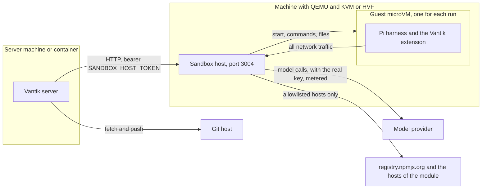

## Overview

Each hosted agent run works in its own microVM. The sandbox host
(`apps/sandbox-host`) starts these microVMs. The server does not start them.
The server calls the sandbox host over HTTP.

This page is for the operator of a Vantik instance. It tells how to bring up
the sandbox host, and how to find a fault. To start a run, read
[Delegate an issue to an agent](/agents/delegating-an-issue). Only a person
starts a run, with the delegate control on an issue.

## How the parts connect



- The server sends the files of the run to the sandbox host: the checkout, the
  prompt, and the context of the issue. Then it runs each command in the guest
  through the sandbox host.
- The guest has no direct network. The sandbox host sends each request of the
  guest, and it refuses each host that is not on the allowlist of the run.
- The server fetches the repository and pushes the branch. The guest never
  connects to the git host.

## Why the sandbox host is a separate process

A microVM needs QEMU and hardware virtualisation: KVM on Linux, or HVF on
macOS. The server often runs in a container that has neither. On macOS, no
container gets hardware virtualisation. So the sandbox host runs where the
hypervisor is, and the server calls it.

If the server cannot reach a sandbox host, the server refuses each new run.
The delegate control on the issue shows the reason. The server never uses a
weaker sandbox in place of a microVM.

## Requirements

- QEMU. The sandbox host needs `qemu-img`, and `qemu-system-aarch64` or
  `qemu-system-x86_64` for the architecture of the machine.
- Hardware virtualisation. Without it, QEMU emulates the processor. The runs
  then work, but they are very slow.
- For a native sandbox host: a checkout of the repository, Node.js 23.6 or
  later, and pnpm 10. The container image has Node.js 24, and it needs none of
  these.
- Memory and disk for each run. Each guest gets 4096 MB of memory and 2 CPUs.
  Its disk can grow to 30720 MB with the review, or 20480 MB without it. The
  disk is sparse, so a run uses only the space that it writes.
- To build the guest image: podman or Docker on macOS, or `e2fsprogs` on
  Linux. Only a native sandbox host can use the guest image.

## Bring up the sandbox host

### 1. Make the token

The server and the sandbox host must have the same token. The sandbox host
does not start if the token has fewer than 24 characters.

```bash
echo "SANDBOX_HOST_TOKEN=$(openssl rand -hex 32)" >> .env
```

### 2. On macOS, run it natively

Run each command in this section from the root of the checkout.

1. Install QEMU and the dependencies of the workspace.

```bash
brew install qemu
pnpm install
```

2. Build the guest image. This step takes a few minutes. Read
   [The guest image](#the-guest-image).

```bash
pnpm --filter sandbox-host build:guest
```

3. Start the sandbox host in a terminal. Keep the terminal open.

```bash
pnpm sandbox-host
```

The sandbox host reads the `.env` file at the root of the repository. A
variable that the environment already sets wins over the file. The sandbox
host listens on `127.0.0.1:3004`.

The server container reaches it at `http://host.docker.internal:3004`, which
is the default in `docker-compose.yaml`. If you run the server with
`pnpm dev`, add the local address to `.env`:

```bash
echo "SANDBOX_HOST_URL=http://127.0.0.1:3004" >> .env
```

4. Make the server read the new values. If the server runs in a container,
   create the container again:

```bash
docker compose up -d --no-deps --force-recreate server
```

   If you run the server with `pnpm dev`, stop it and start it again.

### 3. On Linux, run the container

1. Tell the server container the address of the sandbox host.

```bash
echo "SANDBOX_HOST_CONTAINER_URL=http://sandbox-host:3004" >> .env
```

2. Start the sandbox host with the `sandbox` compose profile. The command also
   creates the server container again, so that the server reads the new values.

```bash
docker compose --profile sandbox up -d --no-deps --force-recreate server sandbox-host
```

The container needs `/dev/kvm`. The entrypoint starts as root only to find the
group that owns `/dev/kvm`. Then it runs the sandbox host as the `node` user,
with that group. The container publishes no port. Only the server, on the
compose network, calls it.

The container image does not include the Vantik guest image. So the container
uses the stock image of Gondolin, the library that starts the microVMs. The
first run downloads that image into the `sandbox-images` volume, so that run
takes longer. With the stock image, each run keeps its checkout in memory.
A native sandbox host on Linux can use the guest image, as on macOS. But with
the defaults, the server container cannot reach a native sandbox host on
Linux. The sandbox host listens on `127.0.0.1`, and Docker on Linux does not
resolve `host.docker.internal`. This page does not give that network setup.
Read [Without the guest image](#without-the-guest-image).

### 4. Check the sandbox host

1. Look at the first log lines of the sandbox host. The line
   `Listening on <address>:<port>` has `available: true` when the sandbox host
   can start a microVM. If `available` is false, the line also has a `reason`.
2. Look for a warning about the guest image. If it shows, read
   [The guest image](#the-guest-image).
3. Open an issue in Vantik that has a module with a repository, and a
   description of 40 characters or more. The delegate control must show no
   reason.

## Configuration

The server reads two of these settings. The sandbox host reads the others. Each
one goes in `.env`.

| Variable | Read by | Default | What it does |
| --- | --- | --- | --- |
| `SANDBOX_HOST_TOKEN` | Server and sandbox host | not set | The shared secret. The server sends it as a bearer token. The sandbox host refuses to start without it, or with fewer than 24 characters. |
| `SANDBOX_HOST_URL` | Server | not set | The address of the sandbox host. Without it, the server refuses each run. In the compose file, the server container gets this value from `SANDBOX_HOST_CONTAINER_URL`. |
| `SANDBOX_HOST_CONTAINER_URL` | `docker-compose.yaml` | `http://host.docker.internal:3004` | The value of `SANDBOX_HOST_URL` in the server container. With the `sandbox` profile, set `http://sandbox-host:3004`. |
| `SANDBOX_HOST_PORT` | Sandbox host | `3004` | The port of the sandbox host. |
| `SANDBOX_HOST_BIND` | Sandbox host | `127.0.0.1` | The address of the sandbox host. The container image sets `0.0.0.0`. On a workstation, keep the loopback address, so only the local server can connect. |
| `SANDBOX_HOST_IDLE_MS` | Sandbox host | `300000` (5 minutes) | The sandbox host disposes of a sandbox that gets no request in this time. The server sends a keepalive each minute while it holds a sandbox. So only the sandbox of a stopped server gets to this limit. |
| `SANDBOX_HOST_GRACE_MS` | Sandbox host | `120000` (2 minutes) | The time after the time limit of a run before the sandbox host disposes of its sandbox. |
| `SANDBOX_HOST_MAX_BODY_MB` | Sandbox host | `512` | The largest request body that the sandbox host accepts, in MB. The server sends the checkout of the repository in one request. |
| `GONDOLIN_VMM` | Gondolin, in the sandbox host | `qemu` | The virtual machine monitor: `qemu` or `krun`. Keep `qemu`. Read [The virtual machine monitor](#the-virtual-machine-monitor). |

The sandbox host does a check of its sandboxes each 15 seconds. When it stops
on `SIGINT` or `SIGTERM`, it disposes of each sandbox.

The server also has settings for the lease, the attempts, and the concurrency
of agent runs. Read the
[Environment reference](/oss/self-deployment#environment-reference).

## The guest image

The command `pnpm --filter sandbox-host build:guest` builds the Vantik guest
image. It tags the image `vantik-guest:latest` in the local image store of
Gondolin. The default store is `~/.cache/gondolin/images`. On macOS, Gondolin
builds the filesystem in a container, so podman or Docker must run.

The sandbox host looks for the image each time that it starts a sandbox. A new
image thus applies from the next run, and you do not restart the sandbox host.
If the image is not there, the sandbox host logs a warning when it starts.

### Without the guest image

The stock image has a root filesystem of about 260 MB, with about 80 MB free.
That filesystem cannot grow. So without the Vantik image, the sandbox host
puts a tmpfs on `/workspace`. A tmpfs is memory. Its limit is three quarters
of the memory of the guest, so 3072 MB.

The checkout, its dependencies, and the harness then share the memory that the
commands of the agent use. A repository with a large `node_modules` fills most
of it. The guest then uses its time to get memory back, not to run the tests.
The run then looks like a model that stopped. Build the guest image to stop
this fault.

With the Vantik image, the root disk grows to the disk limit of the run, and
`/workspace` is a directory on that disk. The image adds `resize2fs` for this
purpose.

### What the image holds

- Alpine Linux 3.23, with the `linux-virt` kernel.
- `bash`, `curl`, `git`, `openssh`, Node.js, npm, Python 3 and `uv`.
- The code tools of the agent: `ripgrep`, `ast-grep`, `fd` and `jq`.
- The Pi harness, at the version that the server pins. The image writes that
  version to `/opt/vantik/pi-version`.
- TypeScript 5.9.3, `typescript-language-server` and `pyright`.

When the image is current, a run fetches nothing at run time for the harness.

### When to build it again

Build the image again after an upgrade that changes the Pi version, or after a
change to `apps/sandbox-host/guest/build-config.json`. A run compares the
version in the image with the version that the server pins. If they are
different, each pass of the run fetches Pi from `registry.npmjs.org`. That run
is slower, but its result is correct.

### The virtual machine monitor

`GONDOLIN_VMM` selects the backend of Gondolin. The default is `qemu`. The
value `krun` selects libkrun, which Gondolin calls experimental. It also needs
the krun runner of Gondolin. The sandbox host does a check for the QEMU
programs only when the backend is `qemu`.

Keep `qemu`. In the tests of this project, krun did not make a run faster.

## Isolation and credentials

- **One microVM for each run.** If the sandbox host cannot start a microVM,
  the run fails. Vantik never uses a container in its place.
- **The model key.** The guest gets a placeholder in the variable that the SDK
  of the provider reads, for example `ANTHROPIC_API_KEY`. The sandbox host puts
  the real key in the requests to the host of the provider, and to no other
  host. If the agent prints its environment, it prints only the placeholder.
- **Where the key comes from.** A run uses only the keys of the workspace, from
  **Settings → Agents**. It never uses a key from the environment of the
  server. Read [Model access](/settings/agents#model-access).
- **No git token in the guest.** The server fetches the repository, and sends
  it to the guest as an archive. After the work, the server reads the tree
  back. Then the server pushes the branch and opens the pull request.
- **No Vantik token in the guest.** The Vantik tools in the guest write lines
  to an outbox file. After each pass, the server reads the file and checks each
  line. Then it applies the line as the agent of the run. A note becomes a
  comment on the issue, and a fact becomes a proposed knowledge entry. The
  server ticks a criterion only when the run succeeds.
- **The egress allowlist.** A guest can reach the host of its model provider,
  `registry.npmjs.org`, and the hosts that its modules declare. The git host is
  not on the list. The sandbox host refuses each other host, and Vantik counts
  each refused request on the run. A sudden increase can show a prompt
  injection.

A module declares its hosts in the **How to verify the work** section of its
page. Read [How to verify the work](/fundamentals/product-axis#how-to-verify-the-work).

## Executors

An executor is the backend that does the work of a run. Vantik has one
executor, `hosted`, with the label **Vantik hosted sandbox**. It runs the
review cycle in a sandbox from the sandbox host. Read
[The review cycle](/agents/review-cycle).

The server registers the executors when it starts. A run that names no
executor uses the only one that is registered, so you set nothing. Vantik has
no runner on another machine that asks the server for work.

The hosted executor is available to a workspace when two conditions are true:

- The server can reach a sandbox host, and that sandbox host can start a
  microVM.
- The workspace has a model key in **Settings → Agents**.

## How Vantik measures the spend

Two sources give the cost of each model call:

- **The harness.** Pi reports the cost of each message, from the token counts
  and the prices in its catalog.
- **The egress meter.** The sandbox host reads the usage of each response from
  the provider, as the bytes go to the guest. A gateway, for example
  OpenRouter, also reports the cost that it bills. The guest cannot change this
  record.

The server joins the two sources on the response ID. A call uses the billed
cost when the provider reported one, and the catalog price if not. A metered
call that the harness did not record, for example a cut stream, still adds its
billed cost.

The page of the run shows the spend while the run works. While a pass works, the
server writes it a maximum of one time in 3 seconds. When a pass ends, the
server writes it immediately. The review cycle compares the spend with
**Spend per issue (USD)** in **Settings → Agents** between passes. The default
is $5. Read [The budget](/agents/review-cycle#the-budget).

The same figures go to your telemetry backend. Each model call is a `chat
<model>` span with `gen_ai.usage.cost`. The attribute `vantik.llm.cost_source`
tells if the cost is `provider` or `catalog`. Read [The telemetry
contract](/oss/self-deployment#the-telemetry-contract).

## How to find a fault

Compose reads `.env` only when it creates a container. A restart of a
container does not read it again. So to apply a change to `.env`, create the
container again with `docker compose up -d --no-deps --force-recreate <service>`.
For a native process, stop it and start it again.

| What you see | Cause | What to do |
| --- | --- | --- |
| The delegate control says "No sandbox host is configured". | The server has no `SANDBOX_HOST_URL` or no `SANDBOX_HOST_TOKEN`. | Set both for the server. Then create the server container again. |
| The delegate control says "The sandbox host at `<url>` did not answer". | The sandbox host does not run, or the address is wrong. | Start the sandbox host. In a container, `127.0.0.1` is the container itself, so use `host.docker.internal` or the name of the service. |
| The delegate control says "The sandbox host refused the server's token". | The two tokens are different. | Set the same `SANDBOX_HOST_TOKEN` for both. Then apply the change to both. |
| The sandbox host stops when it starts, with a message about `SANDBOX_HOST_TOKEN`. | The token is not set, or it has fewer than 24 characters. | Make a token as in [Make the token](#1-make-the-token). |
| The reason says that the sandbox host has no `qemu-img` or `qemu-system-*` on its `PATH`. | QEMU is not installed for the process of the sandbox host. | Install QEMU on the machine of the native sandbox host. Then stop the sandbox host and start it again. |
| The container logs "No /dev/kvm in this container". | The container has no hardware virtualisation. | On Linux, give the container `/dev/kvm`. On macOS, run the sandbox host natively. |
| A run on a large repository becomes very slow, and the model looks stopped. | The sandbox host has no guest image, so the checkout is in memory. | For a native sandbox host, build the guest image. The next run uses it. The container cannot use the guest image. |
| After an upgrade, each pass of a run starts slowly. | The guest image has a different Pi version from the server, so each pass fetches Pi with `npx`. | Build the guest image again. |
| A run fails, and the reason says that the request body is larger than a number of bytes. | The checkout is larger than `SANDBOX_HOST_MAX_BODY_MB`. | Increase `SANDBOX_HOST_MAX_BODY_MB` for the sandbox host. Then apply the change to the sandbox host. |
| A setup command cannot get its packages. | The host of the package registry is not on the allowlist. | Add the host in **How to verify the work** on the page of the module. |
| A run starts a new attempt after the server stopped during the run. | The lease of the run expired. The lease sweep starts the next attempt, to a maximum of `AGENT_RUN_MAX_ATTEMPTS`. | Nothing. Read the [Environment reference](/oss/self-deployment#environment-reference) for the lease settings. |
| The first pass fails with a message from the provider, for example "invalid API key". | The provider refused the key or the model. | Correct the key or the model in **Settings → Agents**. |
| The telemetry backend shows no `chat <model>` spans or no costs. | The backend dropped the batches, for example at its memory limit. | Look at the logs of the backend first. |

After a server stops during a run, its sandbox stays until
`SANDBOX_HOST_IDLE_MS` ends. When the server starts again, it disposes of the
sandboxes of runs that ended.
